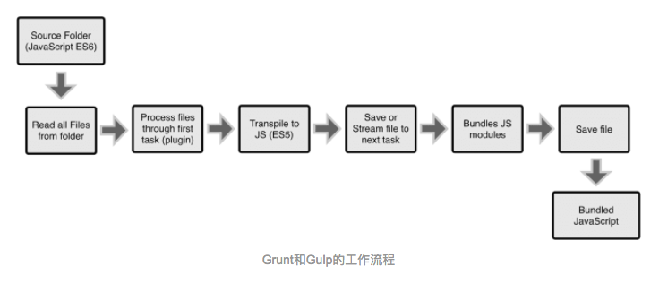
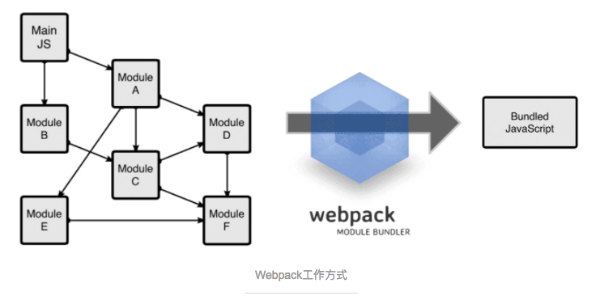

## lesson 1

> 学习了webpack有一段时间,写份笔记做记录 .

### lesson-1主要内容:构建一套基于开React开发的脚手架
特性

- react
- redux
- react-router
- react-router-redux
- webpack
- babel
- express
- ES6


### 前言:

Webpack 是当下最热门的前端资源模块化管理和打包工具。它可以将许多松散的模块按照依赖和规则打包成符合生产环境部署的前端资源。
还可以将按需加载的模块进行代码分隔，等到实际需要的时候再异步加载。通过 loader 的转换，任何形式的资源都可以视作模块，比如
CommonJs 模块、 AMD 模块、 ES6 模块、CSS、图片、 JSON、Coffeescript、 LESS 等。

#### Webpack 和 gulp 没有可比性

也许你用过gulp,有了gulp你可以对css ,js 文件进行压缩合并等处理,但随着前端技术不断发展,出现了前端资源模块化,资源按需
加载,ES6模块等,利用gulp来构建你的项目就显得力不从心了.如果非要做个对比的话,下面给出两张工作流程图片就明白了

>Grunt和Gulp的工作方式是：在一个配置文件中，指明对某些文件进行类似编译，组合，压缩等任务的具体步骤，这个工具之后可以自动替你
完成这些任务。



>Webpack的工作方式是：把你的项目当做一个整体，通过一个给定的主文件（如：index.js），Webpack将从这个文件开始找到你的项目的
所有依赖文件，使用loaders处理它们，最后打包为一个浏览器可识别的JavaScript文件。




### 项目构建

 切到 在lesson-1 的根目录下执行
```
 npm install
 // 如果是 Mac 需要权限
 sudo npm install
 // 如果安装过 npm 淘宝镜像
 cnpm install

```

开发过程中你会用到以下命令:

| lesson-1根目录下运行命令行       | 解释   |  
| ------------- |:-------------:|  
| webpack     | 该命令会默认找到根目录下 webpack.config.js 文件并运行|  
| npm run dev     | 改命令会找到 根目录下的 package.json 文件 并运行 文件下的 scripts 下的 dev命令，其实也就执行 node server.js  |    
| npm run hot  | 改命令是同上 其实是执行 node server.hot.js   |     
| npm run build | 改命令是同上 ，会执行 webpack --config webpack.config.dist.js --progress --colors --watch -p|  ##

#### 1, webpack 命令

>执行该命令会执行 根目录下 webpack.config.js  ,其实这里是为了讲解 webpack 的工作原理和演示
> 项目用的最多的是 webpack.config.hot.js 和 webpack.config.build.js 后面会做讲解

webpack.config.js 大致流程图:


#### (1)、entry

```
entry: {
        app: APP_FILE
    }
```

指定一个入口文件,webpack将会顺藤摸瓜识别所依赖的文件,再一个个进行接下去的解析处理

#### (2)、output

```
output: {
        publicPath: '/pxq/dist/', //编译好的文件，在服务器的路径,这是静态资源引用路径
        path: BUILD_PATH, //编译到当前目录
        filename: '[name].js', //编译后的文件名字
        chunkFilename: '[name].[chunkhash:5].min.js',
    },
```

指定一个出口路径,当webpack处理完依赖文件后,将输出文件输出到指定路径下
其中:
> filename: '[name].js'

指输出 js 文件名 同 entry: 的输入文件名的配置一样,这里是会输出 app.js

> chunkFilename: '[name].[chunkhash:5].min.js'

会对输出的文件添加后缀 , 一个5位的 hash 值

#### (3)、devtool

```
devtool: 'cheap-module-eval-source-map',
```

除了输出编译后的文件外,还会顺带输出一个 Source Map 。什么是 Source Map呢，Source map就是一个信息文件，里面储存着位置信息。也就是说，转换后的代码的每一个位置，所对应的转换前的位置。如转码后的 ES6文件或 React的jsx文件 当代码出错我们很难找到对应的出错位置，那
Source Map 就提供了一个对应关系，来指出错误的位置。

#### （4）、resolve

```
resolve: {
        extensions: ['', '.js', '.jsx', '.less', '.scss', '.css'], //后缀名自动补全
    }
```
这个配置可以帮我们自动补全后缀名，当我们 import 一个 demo.js 时可以这么写不带后缀的

>import demo from 'demo';

#### (5)、module
```
module: {
      loaders: [{
          test: /\.scss$/,
          exclude: /^node_modules$/,
          loader: ExtractTextPlugin.extract('style', ['css', 'autoprefixer', 'sass']),
          include: [APP_PATH]
      },{
          test: /\.js$/,
          exclude: /^node_modules$/,
          loader: 'babel',
          include: [APP_PATH]
      },{
          test: /\.(png|jpg)$/,
          exclude: /^node_modules$/,
          loader: 'url-loader?limit=8192&name=images/[hash:8].[name].[ext]',
          //注意后面那个limit的参数，当你图片大小小于这个限制的时候，会自动启用base64编码图片
          include: [APP_PATH]
      }, {
          test: /\.jsx$/,
          exclude: /^node_modules$/,
          loaders: ['jsx', 'babel'],
          include: [APP_PATH]
      }]
  },
```
webpack 的核心部分就是各种 loader 了 ，webpack 拿到入口文件，并顺藤摸瓜解析到各种依赖文件，遇到不同的文件后缀就执行对应的loader进行处理
其中
> test: /\.scss$/,

当依赖文件有以 .scss 后缀的文件，会先执行 sass-loader 再 执行 autoprefixer-loader（给一些css3添加后缀的loader）
接着执行 css-loader ，这才转化成立 .css 文件，才能作用于浏览器，而 style-loader 是将 .css 文件插入到 html的 head 头部
也许你会注意到 ExtractTextPlugin() 包裹一堆loader是干嘛的，这样放着下面 webpack的插件这一节讲

> test: /\.js$/,

当依赖文件有以 .js 后缀的文件 ，会经过 loader: 'babel', 这里多做了一步跳转是 babel会找到根目录下咱们配置的一个 .babelrc文件
```
{
  	"presets": [
  		"react",
  		"es2015",
  	 	"stage-0",
  	],
  	"plugins": [
        "transform-decorators-legacy",
        "transform-class-properties"
    ]
}
```
.js 文件会根据上面的配置进行解析

> test: /\.(png|jpg)$/,

图片干嘛需要 loader呢，上面也解释了 可以将一个较小的图片进行 base64转换

> test: /\.jsx$/,
React 独有的 .jsx 文件 ，相对 .js文件多了一步 jsx-loader

#### （6）、plugins
```
plugins: [
        new webpack.DefinePlugin({
            'process.env': {
                NODE_ENV: JSON.stringify('development') //定义编译环境
            },
            'cdnUrl':JSON.stringify('http:demo.com/'),
            'dev': true
        }),
        new HtmlWebpackPlugin({  //根据模板插入css/js等生成最终HTML
            filename: '../index.html', //生成的html存放路径，相对于 path
            template: './src/template/index.html', //html模板路径
            hash: false,
        }),
        new ExtractTextPlugin('[name].css')
    ],
```
其中：
> DefinePlugin

定义一下全局变量，可以在模块中使用这些变量
如一个项目中依赖的 demo.js 文件
```
console.log(cdnUrl);
```
编译后的 demo.js 输出：
```
console.log(‘http:demo.com/’);
```
这个全局变量有什么作用呢，如果你有点项目经验就知道这个 plugin 的巨大好处了，举个小例子，咱们在项目开发时，线上环境
和开发环境是不一样的，比如 cdn资源路径，就可以定义全局变量来更改全局路径资源：
```
if(dev){ // dev 是 DefinePlugin 的一个全局变量

}else{

}
```

> HtmlWebpackPlugin

```
plugins: [
        new HtmlWebpackPlugin({                     //根据模板插入css/js等生成最终HTML
            filename: '../index.html',              //生成的html存放路径，相对于 path
            template: './src/template/index.html',  //html模板路径
            hash: false,
        })
    ],
```

依赖文件经过 webpack 编译完输出到指定的目录下 ，那怎么被 html 引用呢，那就需要 HtmlWebpackPlugin 插件。
用法上面有注释就不多说。

> ExtractTextPlugin
```
plugins: [
        new ExtractTextPlugin('[name].css')
    ],
```
我们会在 .js 文件 import .css 或 .scss 文件，webpack 编译 .js 文件时会将这个css文件打包进了 js文件里头。
但有时我们的 css文件比较大或想单独拿出来，那就可以利用这个插件 ExtractTextPlugin ，目的是生成单独的一份 css
文件，而不是打包到 .js 文件里头
